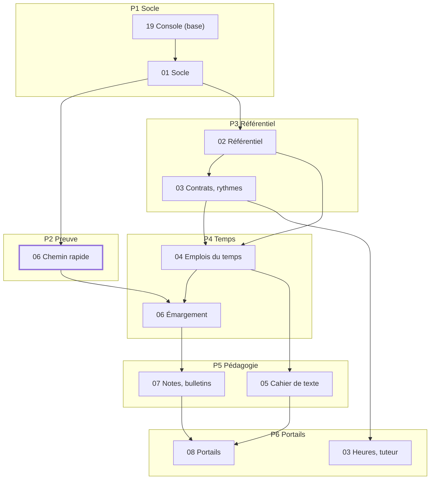
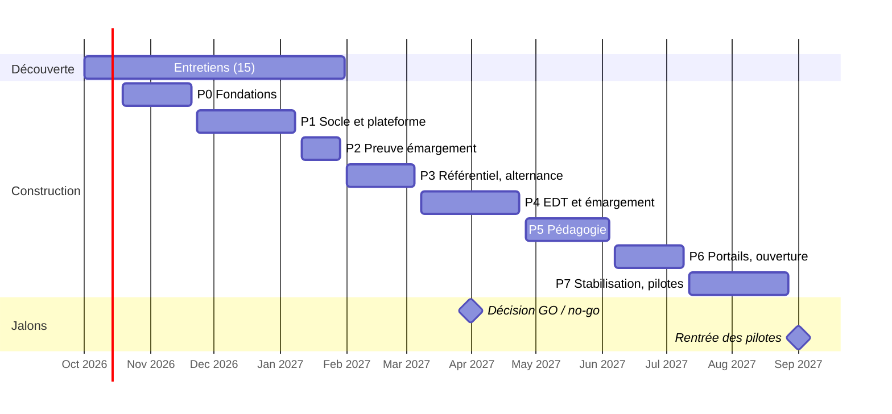

# Plan de développement du MVP Scolaly

> Document de travail : https://claude.ai/code/artifact/18c3bf19-753b-4fd5-8b1c-e102b7daec93
> Validé le 03/10/2026 (lots 1 à 3)

Le MVP de Scolaly couvre les modules 01 à 08 et la base du module 19. Il se construit en 7 phases, de fin octobre 2026 à début juillet 2027, puis se stabilise en juillet et août (phase P7) pour accueillir 3 écoles pilotes à la rentrée 2027. Les écrans V2 déjà maquettés forment ensuite une phase « V2 anticipée », ordonnée par le calendrier des écoles.

**Sources** : [cahier des charges](https://github.com/kylian69/school/tree/main/docs/cahier-des-charges) (modules 00 à 19, validé le 02/10/2026), [architecture technique](https://github.com/kylian69/school/blob/main/docs/architecture/architecture-technique.md) (validée le 02/10/2026), [maquettes du MVP](https://claude.ai/artifact/7ApKj7ouG99grZMUu5EqLN) (43 écrans, lots 1 à 6) et [synthèse de l'étude business](https://github.com/kylian69/school/blob/main/docs/business/synthese-etude-business.md).

**Principes directeurs**

- **Des tranches verticales** : chaque incrément livre un parcours complet (base, API, interface, tests), démontrable sur le jeu de démonstration.
- **L'ordre suit les dépendances** : on ne construit un module que lorsque les données dont il dépend existent.
- **Le risque d'abord** : le chemin rapide de l'émargement est prouvé avant le 31/03/2027, condition du GO de l'étude business.
- **Aucune règle légale en dur** : seuils, taux, nomenclatures et durées vivent dans `packages/referentials`, avec une date de début, une date de fin et leur source.
- **Les décisions validées ne sont pas rediscutées ici** : ce qui semble à revoir est signalé dans la dernière section.
- **Les ajustements visuels des maquettes** se font pendant les tests de l'outil ; ils ne bloquent aucune phase.

## 1. Périmètre du MVP et hors-périmètre

Le MVP livre les 9 modules que le cahier des charges classe en phase MVP, soit 107 user stories « Must », et 16 des 43 écrans maquettés. Parmi les 27 autres, les 24 écrans V2 forment la phase « V2 anticipée » (décisions des 02 et 03/10/2026), après la rentrée 2027 ; le plan d'aménagements du référent handicap et les 2 écrans Moodle restent en V3. L'export de l'EDT vers l'agenda, visible dans l'écran V2 « Mes connexions », est livré dès le MVP avec les flux iCal personnels (I4.2). Les « Should » entrent dans le MVP si le planning le permet ; les « Could » sont reportés par défaut.

### Modules du MVP

| Module | Contenu livré au MVP | Must | Écrans maquettés |
| --- | --- | --- | --- |
| 01 Socle | Établissements, années et périodes, comptes et double authentification, rôles et périmètres, imports CSV/Excel, journal d'audit, corbeille, personnalisation, groupe d'écoles | 15 | Démarrage et apparence, Rôles et permissions, Fiche apprenant |
| 02 Référentiel | Formations, maquettes versionnées, règles de validation et de compensation, compétences, promotions, groupes, inscriptions, salles, duplication d'année | 13 | (au travers de la fiche apprenant et de l'EDT) |
| 03 Alternance (base) | Entreprises (SIRET, IDCC, OPCO), tuteurs, fiche contrat simplifiée, conventions de stage, rythmes, heures prévues et réalisées, portail tuteur, alertes au tuteur | 12 | Espace tuteur |
| 04 Emplois du temps | Séances sur grille, détection des conflits, import Excel/CSV et iCal, publication, vues et flux iCal, heures planifiées et réalisées | 12 | Emploi du temps — semaine |
| 05 Cahier de texte | Contenu de séance, travail à faire, progression prévue, relances, programme réalisé | 7 | Saisie de séance (mobile) |
| 06 Émargement | QR rotatif, chemin rapide sans SQL, appel manuel, validation horodatée, justificatifs, seuils et alertes, feuilles PDF | 14 | Écran intervenant, Émargement apprenant |
| 07 Notes et bulletins | Saisie tableur, compétences, moteur de calcul, circuit de validation, bulletins, relevés et attestations PDF | 13 | Saisie des notes |
| 08 Portails et notifications | Accueils par rôle, PWA hors ligne, centre de notifications, push et email, annonces, « Mes documents » | 11 | Accueil apprenant, Accueil intervenant, Tableau de bord scolarité, Notifications, Rédiger une annonce |
| 19 Administration (base) | Console plateforme, cycle de vie des clients, usage, formules, accès du support, licences auto-hébergées, site de démonstration, page de statut | 10 | Mon abonnement, Console plateforme |

Les écrans du MVP n'affichent que les modules actifs de l'organisation (RG-19-04) : les entrées V2 visibles dans les maquettes (Recrutement, Facturation, Jurys…) restent masquées tant que leur module n'existe pas.

### Tables réglementaires datées nécessaires dès le MVP

Chaque table vit dans `packages/referentials`, avec date de début, date de fin et source. Aucune valeur n'est écrite dans le code métier.

| Table | Utilisée par |
| --- | --- |
| Correspondance IDCC → OPCO | 03 (fiche entreprise, RG-03-02) |
| Minimum légal de formation : part de la durée du contrat, plancher en heures, par type de contrat | 03 (RG-03-16) |
| Stages : durée maximale, seuil et taux de gratification | 03 (conventions de stage) |
| Durée légale du statut « apprenti sans employeur » | 03 (cas limite de rupture) |
| Jours fériés nationaux | 01 et 04 (calendrier, conflits) |
| Durées de conservation par défaut (RGPD-04) | 01 (purges planifiées) |
| Mentions obligatoires des documents officiels (attestations, relevés) | 07 et 08 (modèles Typst) |

### Exigences non fonctionnelles incluses

- Émargement : 5 000 scans en 60 s, p99 < 200 ms, 0 scan perdu ou en double, sur 4 vCPU et 8 Go (module 00, section 6).
- Pages courantes p95 < 300 ms pour 500 utilisateurs simultanés ; recherche globale < 300 ms ; 500 bulletins en moins de 2 minutes.
- Accessibilité RGAA 4 / WCAG 2.2 AA, thèmes clair et sombre, PWA mobile dès 360 px.
- SaaS multi-organisation et auto-hébergement Docker Compose, fonctionnellement identiques (RG-00-07).

### Hors périmètre du MVP

| Élément | Phase | Raison |
| --- | --- | --- |
| 24 écrans V2 maquettés : contrats et dossier OPCO, partie employeur, plan de financement, factures, espace payeur, candidatures, dossier candidat, grille d'entretien, entonnoir, suivi des alternants, livret, délibération du jury, espace entreprise, qualité, réponse à une enquête, exports libres, mes devoirs, correction des copies, pilotage d'une épreuve, clés d'API, webhooks, connexion unique, connecteurs d'agenda et de visio, mes connexions | V2 anticipée | Modules 09 à 16 et 18 classés V2 ; ordonnés en section 2 |
| Qualité et BPF (12), devoirs et examens (15), pilotage et exports réglementaires (16), API publique et connecteurs (18) : hors écrans maquettés, placés dans la V2 anticipée | V2 | Cahier des charges |
| Référent handicap et formation continue (17, écran maquetté : Plan d'aménagements), connecteur Moodle (écrans maquettés : assistant Moodle des Connecteurs, Correspondance Moodle), génération automatique de l'EDT | V3 | Cahier des charges |
| SSO et connexion Google ou Microsoft, messagerie interne, SMS, signature manuscrite à l'écran, sessions de rattrapage | V2 | Décisions des 01 et 02/10/2026 |
| Accès des responsables légaux d'apprenants mineurs | V2 ou plus tard | Décision du 01/10/2026 |
| Paiement en ligne et facturation automatique des abonnements | Non prévu | Module 19 : tout sur devis |
| Application mobile native | Non prévu | La PWA suffit (module 08) |

## 2. Découpage en phases et incréments livrables

Le MVP se construit en 8 phases (P0 à P7) et 25 incréments. L'ordre suit trois règles : un module n'est construit qu'après les données dont il dépend, le chemin rapide de l'émargement est prouvé tôt (condition du GO), et le module 03 est coupé en deux, car ses rythmes servent à l'EDT alors que ses heures réalisées viennent de l'émargement.

Chaque incrément est une tranche verticale fusionnée sur `main`, déployée en préproduction et démontrable sur le jeu de démonstration. Un incrément dure de 1 à 3 semaines.

*Schéma : dépendances entre modules, phases P1 à P6. Une flèche va du module qui fournit les données vers celui qui les utilise.*

Le module 03 apparaît deux fois : ses rythmes alimentent l'EDT en P3, ses heures réalisées et le portail tuteur attendent l'émargement en P6. Non dessinés pour la lisibilité : 02 alimente aussi 07 (maquettes et règles de calcul), 06 alimente 03 (heures réalisées) et la base du module 19 se complète en P6 (licences, groupe, démonstration).

### Phases et incréments du MVP

| Phase | Incrément | Contenu | Dépend de | Écrans |
| --- | --- | --- | --- | --- |
| **P0 Fondations** | I0.1 Monorepo et CI | Squelette `apps/` et `packages/`, lint, typage strict, tests, contrôle des imports, construction et signature des images | — | — |
|  | I0.2 Données et cloisonnement | Schéma des entités centrales (modèle logique), RLS, `SET LOCAL`, test d'isolation par table, audit en ajout seul, boîte d'envoi | I0.1 | — |
|  | I0.3 Socle technique | Better Auth, intercepteur de permissions, BullMQ et planificateur, stockage S3, rendu Typst, emails, chiffrement par champ, `packages/referentials` | I0.2 | — |
|  | I0.4 Système de design et coquille PWA | `packages/ui` d'après les maquettes (jetons, thèmes, navigation, ⌘K vide), coquille installable, textes externalisés | I0.1 | — |
|  | I0.5 Environnements | Docker Compose local, préproduction sur k3s avec Argo CD, jeu de démonstration initial | I0.1 à I0.3 | — |
| **P1 Socle et plateforme** | I1.1 Console plateforme (base) | Création d'une organisation et d'un groupe, formules et modules actifs, cycle de vie (module 19) | I0.3 | Console plateforme |
|  | I1.2 Comptes et droits | Invitation, activation, double authentification, rôles, périmètres, rôles personnalisés, « voir en tant que » | I1.1 | Rôles et permissions |
|  | I1.3 Structure de l'école | Établissements, années, périodes, fériés et fermetures, personnalisation, liste de démarrage | I1.2 | Démarrage et apparence |
|  | I1.4 Personnes et imports | Fiches personnes, photo, matricule, imports CSV/Excel assistés, corbeille, journal d'audit consultable | I1.3 | Fiche apprenant (identité) |
| **P2 Preuve de l'émargement** | I2.1 Chemin rapide | Préchargement Valkey, jeton HMAC rotatif, vérification sans SQL, `SET NX`, flux et persistance par lots, mode dégradé | I0.2, I1.2 | Écran intervenant, Émargement apprenant (version brute) |
|  | I2.2 Preuve de charge | Scénarios k6 (5 000 puis 50 000 scans en 60 s, 5 % de répétitions), rapport sur 4 vCPU / 8 Go et sur k3s | I2.1 | — |
| **P3 Référentiel et alternance (base)** | I3.1 Formations et maquettes | Formations, versions de maquette, blocs, UE, modules, compétences, règles de calcul, duplication | I1.3 | — |
|  | I3.2 Promotions et inscriptions | Promotions, groupes, inscriptions et statut, affectation des intervenants, salles | I3.1, I1.4 | Fiche apprenant (scolarité) |
|  | I3.3 Entreprises, contrats et rythmes | Entreprises (SIRET, IDCC → OPCO), tuteurs, fiche contrat simplifiée, conventions de stage, modèles de rythme et calendriers | I3.2 | Fiche apprenant (alternance) |
| **P4 Temps et présence** | I4.1 Grille d'EDT | Séances unitaires et récurrentes, glisser-déposer, conflits (salle, intervenant, groupe, rythme, fermetures), brouillon et publication | I3.2, I3.3 | Emploi du temps — semaine |
|  | I4.2 Import et diffusion de l'EDT | Import Excel/CSV et iCal avec réimports, flux iCal, annulation, report, remplacement, notifications de changement | I4.1 | Mes connexions (export de l'EDT vers l'agenda seulement) |
|  | I4.3 Émargement complet | Appel QR branché sur les séances réelles, localisation, appel manuel, distanciel, validation horodatée, liste en direct | I2.1, I4.1 | Écran intervenant, Émargement apprenant |
|  | I4.4 Assiduité | Retards, absences, justificatifs et file de traitement, seuils et alertes, feuilles PDF par séance et par mois | I4.3 | Tableau de bord scolarité (assiduité) |
| **P5 Pédagogie** | I5.1 Cahier de texte | Contenu de séance, travail à faire, progression prévue, relances, programme réalisé | I4.1 | Saisie de séance (mobile) |
|  | I5.2 Saisie des notes | Évaluations, saisie tableur, import, notes spéciales, compétences, publication | I3.1, I3.2 | Saisie des notes |
|  | I5.3 Calcul et bulletins | Moteur de calcul dans `packages/domain`, circuit de validation, bulletins, relevés, attestations PDF en lot | I5.2, I4.4 | — |
| **P6 Portails et ouverture** | I6.1 Accueils et notifications | Accueils par rôle, centre de notifications, push et email, préférences, annonces, « Mes documents », recherche ⌘K, hors ligne | P4, P5 | Accueil apprenant, Accueil intervenant, Tableau de bord scolarité, Notifications, Rédiger une annonce |
|  | I6.2 Suivi des alternants et portail tuteur | Heures réalisées et minimum légal, alertes d'absence au tuteur, portail tuteur, calendrier PDF pour l'entreprise | I4.4, I3.3 | Espace tuteur |
|  | I6.3 Groupe et plateforme | Tableau de bord de groupe, accès du support, licences auto-hébergées, site de démonstration, page de statut, notes de version | I1.1, I6.1 | Mon abonnement |
| **P7 Stabilisation et pilotes** | I7.1 Prêt pour la rentrée | Test d'intrusion et corrections, audit RGAA, charge en grandeur réelle, reprise des données des pilotes, documentation, installation auto-hébergée testée | P0 à P6 | — |

### Phase « V2 anticipée » (après la rentrée 2027)

Les 24 écrans V2 déjà maquettés sont ordonnés par leurs dépendances et par le calendrier des écoles : contrats pour la saison d'alternance, candidatures avant les campagnes de recrutement, jurys avant les délibérations de juin, puis qualité, exports et devoirs (lot 5 des maquettes), enfin API, connexion unique et connecteurs (lot 6). La connexion unique passe en tête de V2-I, ou juste après V2-A si une école pilote l'exige. Le détail sera planifié dans un plan V2 ; seul l'ordre est fixé ici.

| Ordre | Bloc | Modules | Écrans | Dépend de | Pourquoi à ce moment |
| --- | --- | --- | --- | --- | --- |
| V2-A | Contrats et OPCO | 10 | Contrats (tableau complet), Dossier contractuel et dépôt OPCO, Partie employeur, Plan de financement | 03 | Tables NPEC datées ; base de la facturation OPCO |
| V2-B | Candidatures | 09 | Candidatures, Dossier candidat, Grille d'entretien, Entonnoir | 02, V2-A | Prêt avant les campagnes de recrutement de la rentrée 2028 |
| V2-C | Facturation | 11 | Factures et impayés, Espace payeur | V2-A | Les factures OPCO s'appuient sur le plan de financement |
| V2-D | Livret et visites | 13 | Suivi des alternants, Livret (tutrice), Espace entreprise | 03, V2-A, V2-C | L'espace entreprise réunit contrats, factures, livret et offres |
| V2-E | Jurys | 14 | Grille de délibération du jury | 07 | Prêt avant les jurys de juin 2028 |
| V2-F | Qualité et enquêtes | 12 | Qualité (32 indicateurs, coffre de preuves), Réponse à une enquête | 05, 06, 07, V2-D | Preuves Qualiopi et BPF attendus pour la rentrée 2028 |
| V2-G | Exports libres | 16 | Exports libres | Modules sources, droits du module 01 | Colonnes sensibles soumises à un droit dédié, exports journalisés |
| V2-H | Devoirs et examens | 15 | Mes devoirs, Correction des copies, Pilotage d'une épreuve | 04, 05, 07 | S'appuie sur le cahier de texte, l'EDT et les notes |
| V2-I | API, connexion unique et connecteurs | 18 | Connexion unique (en premier), Clés d'API, Webhooks, Connecteurs (agendas, Teams, Meet), Mes connexions | 01 (droits, audit), boîte d'envoi et événements internes | Connexion unique souvent demandée dès la signature ; webhooks et connecteurs s'appuient sur les événements déjà publiés |

## 3. Jalons, critères de fin et démos

Le MVP franchit 8 jalons, chacun prouvé par une démo sur le jeu de démonstration. Le jalon J2 fournit la preuve technique attendue pour la décision GO / no-go de mars 2027. Les dates sont celles du planning indicatif (section 8).

### Jalons

| Jalon | Date visée | Critère de passage | Démo |
| --- | --- | --- | --- |
| J0 Fondations prêtes | 20/11/2026 | CI complète et verte ; préproduction déployée par Argo CD depuis `main` ; test d'isolation RLS actif ; installation Docker Compose à neuf en une commande | Fusion d'une PR, déploiement automatique, PWA vide installée sur un téléphone |
| J1 Une école se configure | 08/01/2027 | Organisation créée depuis la console en moins de 10 minutes ; 2 000 apprenants importés avec erreurs corrigées ligne par ligne ; rôles et double authentification actifs | De la création de l'école à la première connexion d'un apprenant |
| J2 Preuve de l'émargement | 29/01/2027 | 5 000 scans en 60 s, p99 < 200 ms, 0 perte et 0 doublon avec 5 % de répétitions, sur 4 vCPU / 8 Go ; 50 000 scans en 60 s sur k3s ; mode dégradé vérifié | QR projeté, scans réels sur téléphones, rapport k6 publié |
| J3 Référentiel complet | 05/03/2027 | Formation complète créée en moins de 30 minutes, dupliquée en 2 minutes ; promotions, groupes, inscriptions, contrats et rythmes en place | Une promotion d'alternants prête à planifier |
| J4 Une semaine de cours réelle | 23/04/2027 | EDT importé puis publié sans conflit ; appel QR et manuel sur les séances réelles ; justificatifs traités ; feuilles d'émargement PDF conformes | Lundi matin d'une école : EDT, appel, absence, justificatif, feuille signée |
| J5 Premier bulletin | 04/06/2027 | Notes saisies au clavier et importées ; moyennes, ECTS et compétences calculés ; 500 bulletins en moins de 2 minutes ; circuit de validation suivi | De la saisie des notes au bulletin signé publié |
| J6 MVP complet | 09/07/2027 | Les 107 « Must » livrés et testés ; gel des fonctionnalités ; seules les corrections entrent ensuite | Parcours complet par rôle, du tuteur à la direction de groupe |
| J7 Prêt pour les pilotes | 27/08/2027 | Failles critiques et élevées du test d'intrusion corrigées ; audit RGAA sans non-conformité bloquante ; charge en grandeur réelle tenue ; données des pilotes reprises ; restauration testée | Rejeu de la rentrée d'un pilote sur ses propres données |

### Definition of ready (avant de démarrer un incrément)

- Les user stories et règles de gestion concernées sont listées dans un ticket, avec leurs numéros (US-NN-xx, RG-NN-xx).
- Les écrans maquettés sont rattachés ; pour un écran sans maquette, le parcours est décrit dans le ticket.
- Les tables réglementaires nécessaires sont identifiées, avec leur source officielle.
- Les maquettes du module ont été montrées à 3 à 5 utilisateurs réels (exigence du module 00, section 5), par exemple pendant les entretiens de découverte.

### Definition of done d'un incrément

- [ ] Chaque critère d'acceptation du cahier des charges est couvert par un test automatisé qui cite son numéro.
- [ ] Les règles de calcul sont dans `packages/domain`, avec 100 % des branches critiques testées.
- [ ] Toute nouvelle table porte `organisation_id`, une politique RLS et passe le test d'isolation.
- [ ] Chaque route déclare sa permission ; les actions sensibles écrivent dans le journal d'audit.
- [ ] Aucune valeur légale dans le code : elle vient d'une table datée de `packages/referentials`, avec sa source.
- [ ] Le parcours principal a son test E2E, y compris à 360 px pour les rôles mobiles ; aucune violation d'accessibilité détectée automatiquement.
- [ ] Les textes sont externalisés ; les erreurs sont expliquées en français clair, avec la marche à suivre.
- [ ] Les migrations respectent « ajouter, basculer, retirer » ; l'installation Docker Compose démarre à neuf et en mise à jour.
- [ ] Le jeu de démonstration couvre le parcours ; l'incrément est déployé en préproduction.
- [ ] La documentation API (OpenAPI) est régénérée, le registre des traitements du module est à jour, la note de version est rédigée.

### Definition of done d'une version publiée

- Toute la CI est verte, y compris le test de charge de l'émargement : une version qui ne tient pas les objectifs n'est pas publiée (RG-00-22).
- Aucune faille critique ou élevée connue dans les dépendances et les images.
- Les images sont signées ; le paquet Docker Compose et la procédure de mise à jour sont publiés avec la note de version en français (EXP-05).

### Démos

- Une démo de 10 minutes à chaque jalon, sur le jeu de démonstration, enregistrée en vidéo.
- Les vidéos servent aussi aux entretiens de découverte et aux écoles pilotes, pour recueillir leurs retours au fil de l'eau.
- Les ajustements visuels relevés pendant les démos sont notés dans un ticket dédié et traités pendant les tests de l'outil, sans bloquer le jalon.

## 4. Organisation du travail

Le développement suit un flux « tronc unique » : `main` est toujours déployable, chaque changement passe par une branche courte et une PR relue, et le travail inachevé reste masqué par l'activation des modules (RG-19-04). L'équipe est le fondateur assisté d'agents IA (étude business) : l'humain décide, relit et fusionne ; les agents rédigent, codent et testent.

### Branches

| Branche | Usage | Durée de vie |
| --- | --- | --- |
| `main` | Code déployable, déployé automatiquement en préproduction | Permanente, protégée |
| `feat/<incrément>-<sujet>` | Fonctionnalité, par exemple `feat/i4.3-appel-manuel` | 1 à 5 jours |
| `fix/<sujet>`, `chore/<sujet>`, `docs/<sujet>` | Correction, maintenance, documentation | Quelques heures à 2 jours |
| `claude/<sujet>` | Branche ouverte par une session d'agent IA | Le temps de la PR |
| `release/AAAA.MM` | Correctifs d'une version déjà livrée aux écoles auto-hébergées | Jusqu'à la fin du support de la version |

Protection de `main` : CI verte obligatoire, une approbation humaine, pas de poussée directe, pas de réécriture d'historique ni de force-push. Les PR sont fusionnées par « squash » : un commit par PR sur `main`.

### Pull requests

- Une PR = un sujet, idéalement moins de 400 lignes hors fichiers générés. Un incrément se livre en plusieurs PR.
- Le titre suit les Conventional Commits en français : `feat(emargement): appel manuel avec photos`.
- La description reprend un modèle : objectif, US et RG couvertes, captures d'écran ou vidéo, tests ajoutés, impact sur les données et le RGPD, migration.
- Toute PR qui touche une table, une permission ou une donnée personnelle coche une liste de contrôle sécurité et RGPD (section 6).

### Revues

| Niveau | Qui | Quand |
| --- | --- | --- |
| Revue automatique | Agent de revue de code (Claude Code Review) et analyses de la CI | Chaque PR |
| Revue humaine | Le fondateur | Chaque PR, avant fusion |
| Revue renforcée | Le fondateur, avec une relecture dédiée sécurité | Fichiers sensibles déclarés dans `CODEOWNERS` : politiques RLS, authentification, permissions, chiffrement, `packages/referentials`, chemin de l'émargement, migrations |
| Revue externe | Prestataire de test d'intrusion | Avant J7, puis chaque année |

Un agent IA ne fusionne jamais une PR et n'approuve jamais la sienne.

### Conventions

- **Langue** : interface, commits, PR, tickets et documentation en français ; vocabulaire technique en anglais dans le code ; termes métier du glossaire (module 00) gardés en français sans accents (`organisation`, `promotion`, `inscription`, `seance`, `emargement`), comme `organisation_id` dans l'architecture.
- **Code** : TypeScript strict, lint et formatage automatiques, règles de dépendance entre modules vérifiées par la CI (architecture, section 2).
- **Tests** : un test d'acceptation porte le numéro de la règle ou de la story qu'il vérifie, par exemple `RG-06-13 valide l'appel avec horodatage`.
- **Versions** : numérotation par date `AAAA.MM.N` (comme `2026.10.1` dans la maquette « Mon abonnement »), note de version en français.
- **Décisions** : toute nouvelle décision d'architecture est consignée dans un court ADR (`docs/adr/`), sans réécrire les décisions validées.
- **Instructions aux agents** : un fichier `CLAUDE.md` à la racine résume ces conventions et renvoie au cahier des charges et à l'architecture.

### Suivi

- GitHub Issues et un tableau GitHub Projects : un jalon GitHub par jalon du plan, un ticket par incrément, découpé en tâches.
- Étiquettes : `module:NN`, `type:feat|fix|chore|docs`, `securite`, `rgpd`, `ux-ajustement` (ajustements visuels traités pendant les tests).
- Revue hebdomadaire de l'avancement : incréments terminés, glissements, risques (section 7).

## 5. Outillage

La CI GitHub Actions bloque toute PR qui casse un test, l'isolation entre organisations ou un objectif de performance. Les tests de charge en grandeur réelle tournent hors de GitHub, sur une machine de référence du cluster Proxmox, car les exécuteurs hébergés ne sont pas représentatifs. Les outils cités sont ceux de l'architecture validée ; les ajouts sont signalés.

### Chaîne d'intégration continue

| Déclencheur | Étapes | Bloquant |
| --- | --- | --- |
| Chaque PR | Installation avec cache pnpm et Turborepo (seuls les paquets touchés) ; lint, formatage, typage ; contrôle des imports entre modules ; tests unitaires ; tests d'intégration sur PostgreSQL 17, Valkey et MinIO en conteneurs ; test d'isolation RLS ; vérification que le schéma Drizzle et les migrations concordent ; diff OpenAPI ; E2E de fumée sur Docker Compose ; analyse d'accessibilité ; recherche de secrets ; analyse statique ; analyse des dépendances | Oui |
| PR qui touche l'émargement | En plus : scénario k6 réduit (pic de 5 000 scans ramené à l'échelle de l'exécuteur), zéro perte et zéro doublon vérifiés | Oui |
| Fusion sur `main` | Construction des images, analyse des images, signature, publication dans le registre ; mise à jour du dépôt de configuration ; Argo CD déploie la préproduction | Oui pour le déploiement |
| Chaque nuit | E2E complets ; k6 émargement 5 000 scans en 60 s sur la machine de référence 4 vCPU / 8 Go ; k6 pages courantes ; rejeu des migrations depuis la version publiée précédente | Alerte, ticket automatique |
| Version (étiquette `AAAA.MM.N`) | Tout ce qui précède, plus k6 50 000 scans sur k3s, paquet Docker Compose, note de version ; promotion en production par une PR sur le dépôt de configuration | Oui (RG-00-22) |
| Chaque mois | Restauration automatique d'une sauvegarde en préproduction et contrôle d'intégrité | Alerte |

### Tests

| Type | Outil | Portée | Seuil |
| --- | --- | --- | --- |
| Unitaires | Vitest | `packages/domain` (calcul des notes, ECTS, compétences, rythmes, heures et minimum légal, jetons HMAC, tables datées) et services | 100 % des branches critiques de `domain` |
| Intégration | Vitest et conteneurs PostgreSQL 17, Valkey, MinIO | Routes de l'API, politiques RLS, matrice rôles × actions de chaque module, files BullMQ, boîte d'envoi | Toutes les routes ; une organisation ne lit jamais une autre |
| Contrats | Schémas Zod, instantané OpenAPI | Formats échangés entre l'interface et l'API | Toute rupture signalée dans la PR |
| Documents | Rendu Typst comparé à une référence | Bulletins, relevés, attestations, feuilles d'émargement ; empreinte déterministe | Aucun écart non approuvé |
| Imports | Fichiers d'exemple | Formats Excel, CSV et iCal ; exports publiés par Hyperplanning, Celcat et ADE, puis fichiers réels des pilotes (décision du module 04) | Tous les fichiers d'exemple importés sans perte |
| Bout en bout | Playwright | Parcours clés : lancer l'appel, scanner, saisir une note, justifier une absence, télécharger un bulletin ; écrans de 360 px ; perte de réseau pendant le scan | Parcours de chaque incrément |
| Accessibilité | axe-core dans Playwright, puis audit manuel RGAA | Chaque page testée | Aucune violation automatique ; audit avant J7 |
| Charge | k6 | Pic d'émargement (5 000 puis 50 000 scans en 60 s, 5 % de répétitions) ; 500 utilisateurs simultanés ; recherche sur 10 000 apprenants ; 500 bulletins | Objectifs du module 00, section 6 |
| Résilience | Scénarios dédiés | Valkey arrêté pendant un appel (mode dégradé), worker tué pendant la persistance, reprise sans perte | Aucune présence perdue |

Ajouts à l'architecture, à valider : axe-core pour l'accessibilité automatique, et un exécuteur GitHub Actions auto-hébergé sur une VM Proxmox de 4 vCPU / 8 Go, réservé à `main` et aux versions.

### Environnements

| Environnement | Plateforme | Données | Mise à jour |
| --- | --- | --- | --- |
| Local | Docker Compose : PostgreSQL, Valkey, MinIO, ClamAV, serveur de mails de test | Jeu de démonstration | À la demande |
| CI éphémère | Conteneurs lancés par GitHub Actions | Jeu de test, détruit après le job | Chaque PR |
| Préproduction (la « recette » de l'architecture) | k3s, espace de noms dédié, base CloudNativePG séparée, quotas de ressources | Jeu de démonstration ; jamais de données réelles | Chaque fusion sur `main` |
| Démonstration | k3s, même image que la production | Jeu de démonstration, réinitialisé chaque nuit ; ouvert 30 jours sur demande (RG-19-15) | Chaque version |
| Production | k3s, CloudNativePG à 3 instances, Valkey avec Sentinel | Données des écoles | Chaque version, après validation en préproduction |
| Référence auto-hébergée | VM 4 vCPU / 8 Go, Docker Compose | Jeu de démonstration | Chaque version : installation à neuf, mise à jour, sauvegarde et restauration testées |

Les tests de charge à 50 000 scans tournent sur la préproduction, qui partage les 3 nœuds avec la production : ils sont lancés hors des heures de cours tant que la production a des utilisateurs.

### Données de démonstration

- Un générateur déterministe dans `packages/db` (graine fixe) produit toujours le même jeu : un groupe de 2 écoles fictives, 2 000 apprenants dont un tiers d'alternants, 80 intervenants, 150 entreprises et leurs tuteurs, une année de séances (environ 40 000), leurs émargements et leurs notes, à la volumétrie de référence de l'architecture.
- Noms, entreprises, SIRET et adresses sont fictifs : les maquettes citent des enseignes réelles, le jeu de démonstration n'en reprend aucune.
- Le jeu grandit à chaque incrément, avec un scénario par démo (par exemple un apprenant en alerte d'absences, un contrat proche de la fin de période d'essai).
- Le même générateur sert au poste local, à la CI, à la préproduction, au site de démonstration et, en volume multiplié, aux tests de charge.
- Aucune donnée réelle ne quitte la production. La reprise des données d'un pilote se fait directement en production, après signature de son accord de traitement des données.

## 6. Sécurité et RGPD dans le développement

La sécurité et le RGPD sont vérifiés à chaque PR, pas en fin de projet. Les mesures de l'architecture (section 4) sont reprises ici sous forme de contrôles concrets, rattachés aux phases où ils se construisent. Scolaly est sous-traitant des écoles en SaaS (RGPD-01) : rien ne doit empêcher une école de remplir ses propres obligations.

### Contrôles automatiques

| Contrôle | Outil ou mécanisme | Quand | Bloquant |
| --- | --- | --- | --- |
| Isolation entre organisations | Test généré pour chaque table : une organisation ne lit, ne modifie ni ne supprime aucune ligne d'une autre | Chaque PR | Oui (SEC-03) |
| Table sans `organisation_id` ni politique RLS | Contrôle du schéma Drizzle | Chaque PR | Oui |
| Route sans permission déclarée | Contrôle au démarrage de l'API et test | Chaque PR | Oui |
| Matrice rôles × actions | Test d'intégration par module, tiré de la section 2 du cahier des charges | Chaque PR | Oui |
| Secrets dans le code | Recherche de secrets | Chaque PR et chaque push | Oui (SEC-07) |
| Failles du code | Analyse statique | Chaque PR | Oui pour critique et élevé |
| Dépendances et images | Analyse des dépendances et des images, mises à jour proposées automatiquement | Chaque PR et chaque nuit | Oui pour critique et élevé ; correctif sous 7 jours (SEC-07) |
| En-têtes HTTP | Test E2E : HSTS, CSP stricte, cookies `HttpOnly`, `Secure`, `SameSite=Lax` | Chaque PR | Oui |
| Données personnelles dans les journaux | Filtre des journaux et test : aucun mot de passe, jeton, IBAN ou numéro de sécurité sociale en clair | Chaque PR | Oui |
| Images déployées | Vérification de la signature avant déploiement | Chaque déploiement | Oui |

### Construit par phase

| Phase | Mesures livrées |
| --- | --- |
| P0 | RLS et rôle applicatif sans contournement, audit en ajout seul et partitionné, chiffrement par champ (AES-256-GCM, une clé par organisation hors de la base), coffre de secrets, Argon2id, sessions serveur, limitation de débit dans Valkey, antivirus des fichiers déposés, liens signés de courte durée |
| P1 | Double authentification obligatoire pour les rôles concernés (RG-00-13), verrouillage progressif, « voir en tant que » en lecture seule et tracé (RG-00-15), accès du support sur autorisation datée (RG-19-09), journal d'audit consultable |
| P2 et P4 | Jeton QR signé HMAC et rotatif, contrôle de localisation qui jette la position et ne garde que le résultat (RGPD-03), rejeu hors ligne borné par une fenêtre de grâce |
| P3 et P6 | Liens à jeton limités dans le temps pour le portail tuteur, fermeture automatique de l'accès à la fin du contrat (RG-00-14) |
| P6 | Export des données d'une personne et outil d'effacement (RGPD-05), purges et anonymisations planifiées (RGPD-04), page de statut |
| P7 | Test d'intrusion par un prestataire, corrections, revue complète des droits par rôle |

### RGPD au fil du développement

- **Registre par module** : chaque incrément met à jour `docs/rgpd/registre.md` (finalité, données, personnes concernées, durée de conservation, destinataires). Ce registre alimente le registre et l'AIPD fournis aux écoles (RGPD-02).
- **Minimisation** : une colonne n'est ajoutée que si une user story l'exige ; aucun motif médical n'est saisi, le justificatif reste un document joint (RGPD-03).
- **Durées de conservation** : valeurs par défaut dans une table datée de `packages/referentials`, paramétrables par l'école dans les limites légales.
- **Données sensibles** : toute nouvelle donnée sensible est chiffrée par champ et son accès journalisé ; au MVP, cela concerne surtout le numéro de sécurité sociale et les jetons des services externes.
- **Mineurs** : certains apprenants sont mineurs ; les textes d'information et les autorisations sur le téléphone (localisation, notifications) sont rédigés pour eux.
- **Sous-traitants ultérieurs** : chaque service externe (envoi d'emails, notifications push) est choisi dans l'Union européenne et inscrit dans la liste fournie aux écoles (RGPD-06).
- **Hors production** : aucune donnée réelle en local, en CI ou en préproduction ; le jeu de démonstration est entièrement fictif.
- **Avant les pilotes** : accord de traitement des données (DPA) signé avec chaque école, AIPD type remise, durées de conservation par défaut relues par un juriste ou un DPO (question encore ouverte du module 00).

### Liste de contrôle d'une PR sensible

- [ ] Nouvelle table : `organisation_id`, politique RLS, test d'isolation, index commençant par `organisation_id`.
- [ ] Nouvelle route : permission et périmètre déclarés, entrées validées par Zod.
- [ ] Action sensible : écriture dans le journal d'audit, avec valeur avant et après.
- [ ] Donnée personnelle nouvelle : justifiée par une story, durée de conservation fixée, registre mis à jour.
- [ ] Donnée sensible : chiffrée par champ, absente des journaux.
- [ ] Fichier déposé : type et taille limités, antivirus, lien signé.
- [ ] Accès externe : jeton aléatoire, durée limitée, révocable.

## 7. Risques et parades

Le risque principal est le calendrier : une seule personne doit livrer 107 « Must » en 9 mois, puis accueillir des pilotes. Les parades reposent sur un ordre de priorité connu à l'avance (ce qu'on reporte si on glisse) et sur des alertes précoces, suivies à la revue hebdomadaire (section 4).

| Risque | Probabilité | Impact | Parade | Signal d'alerte |
| --- | --- | --- | --- | --- |
| Glissement du planning (équipe d'une personne, entretiens de découverte en parallèle) | Élevée | Élevé | Tranches verticales, « Should » et « Could » sacrifiables ; ordre de report prévu : portail tuteur avancé, « voir en tant que », tableau de bord de groupe, puis compétences dans les bulletins ; marge de 7 semaines en P7 | Un jalon dépassé de plus de 2 semaines |
| Preuve de charge de l'émargement non tenue avant le GO de mars 2027 | Moyenne | Critique | Chemin rapide construit dès P2 ; k6 dès le premier prototype ; marge de 8 semaines entre J2 et la décision ; repli sur l'écriture directe en base pour mesurer l'écart | p99 > 150 ms à 5 000 scans pendant P2 |
| Code produit par les agents IA de qualité inégale ou peu sûr | Moyenne | Élevé | Relecture humaine obligatoire, revue renforcée des fichiers sensibles, CI bloquante, tests d'acceptation numérotés, `CLAUDE.md` à jour | Hausse des corrections après fusion |
| Fuite de données entre écoles | Faible | Critique | Deux barrières (permissions et RLS), test d'isolation généré pour chaque table, test d'intrusion avant J7 | Un test d'isolation contourné ou désactivé |
| Moteur de calcul des notes faux dans un cas réel | Moyenne | Élevé | Règles dans `packages/domain`, 100 % des branches critiques, jeux de cas tirés des règlements réels des pilotes, double calcul comparé à leurs bulletins actuels avant la rentrée | Écart entre Scolaly et le bulletin d'un pilote |
| Imports d'EDT et de personnes inadaptés aux fichiers réels | Élevée | Moyen | Fichiers d'exemple Hyperplanning, Celcat, ADE ; demande des fichiers réels aux pilotes dès la lettre d'intention ; correspondance des colonnes configurable | Un fichier pilote non importé sans retouche |
| Notifications push peu fiables sur iPhone | Élevée | Moyen | Email toujours envoyé en secours ; aide à l'installation de la PWA ; push web documenté pour iOS 16.4 et plus, avec PWA installée | Taux d'abonnement push faible sur iOS |
| Coupure du lien internet unique ou sinistre du site | Moyenne | Élevé | File hors ligne de la PWA pour l'émargement ; sauvegardes locales et restauration testée ; feuille de route réseau et hors site déjà écrite (architecture, section 7) | Première école signée sans copie hors site |
| Tests de charge en préproduction qui perturbent la production (mêmes nœuds) | Moyenne | Moyen | Tests à 50 000 scans hors des heures de cours, quotas de ressources par espace de noms | Hausse du temps de réponse en production pendant un test |
| Évolution des règles légales pendant le développement | Élevée | Moyen | Aucune valeur en dur, tables datées avec source, veille réglementaire mensuelle | Publication d'un texte touchant une table |
| Retours des pilotes qui remettent en cause des écrans | Moyenne | Moyen | Démos vidéo à chaque jalon montrées aux écoles ; ajustements visuels traités pendant les tests de l'outil, séparés des fonctionnalités | Plus de 3 retours bloquants sur un même parcours |
| Décision no-go en mars 2027 | Moyenne | Critique | P2 répond à la condition technique ; le code reste réutilisable ; pas d'engagement d'infrastructure coûteux avant le GO | Moins de 3 lettres d'intention en février 2027 |
| V2 anticipée (24 écrans) en concurrence avec les autres attentes de la rentrée 2028 | Élevée | Moyen | Plan V2 dédié établi en août 2027 ; ordre fixé par le calendrier des écoles ; arbitrage possible entre V2-F et les blocs suivants | Retard de V2-A ou V2-B à fin 2027 |
| Fournisseur d'emails ou de push indisponible | Faible | Moyen | Interface propre à Scolaly, disjoncteur, nouvelles tentatives, bascule sur un second fournisseur configurable | Taux d'échec d'envoi au-dessus de 2 % |

## 8. Planning indicatif

Le MVP mobilise 38 semaines de construction (dont 2 de congés), de fin octobre 2026 au 9 juillet 2027, puis 7 semaines de stabilisation jusqu'au 27 août. La preuve de l'émargement (29 janvier) arrive 2 mois avant la décision GO / no-go de fin mars. Les dates sont indicatives : elles se recalent à chaque jalon.

*Schéma : planning indicatif du MVP, d'octobre 2026 à septembre 2027. Chaque fin de phase est un jalon (J0 à J7).*

Les entretiens de découverte (octobre 2026 à janvier 2027) se déroulent en parallèle de P0 et P1 : ils servent aussi à montrer les maquettes à de vrais utilisateurs. P1 inclut 2 semaines de congés de fin d'année.

### Charge par phase

| Phase | Dates | Semaines | Must visés | Jalon |
| --- | --- | --- | --- | --- |
| P0 Fondations | 19/10 → 20/11/2026 | 5 | socle technique | J0 |
| P1 Socle et plateforme | 23/11/2026 → 08/01/2027 | 7 (dont 2 de congés) | 01 (15), 19 en partie | J1 |
| P2 Preuve de l'émargement | 11/01 → 29/01/2027 | 3 | chemin rapide du 06 | J2 |
| P3 Référentiel et alternance | 01/02 → 05/03/2027 | 5 | 02 (13), 03 en partie | J3 |
| P4 Temps et présence | 08/03 → 23/04/2027 | 7 | 04 (12), 06 (14) | J4 |
| P5 Pédagogie | 26/04 → 04/06/2027 | 6 | 05 (7), 07 (13) | J5 |
| P6 Portails et ouverture | 07/06 → 09/07/2027 | 5 | 08 (11), 03 et 19 restants | J6 |
| P7 Stabilisation et pilotes | 12/07 → 27/08/2027 | 7 | corrections uniquement | J7 |

### Après le MVP (indicatif)

| Période | Contenu |
| --- | --- |
| Août 2027 | Plan V2 détaillé, sur le modèle de ce plan |
| Septembre → novembre 2027 | Accompagnement des pilotes ; V2-A Contrats et OPCO |
| Décembre 2027 → janvier 2028 | V2-B Candidatures |
| Février → mars 2028 | V2-C Facturation |
| Avril → mai 2028 | V2-D Livret et visites ; V2-E Jurys prêt pour juin |
| Juin 2028 et au-delà | V2-F à V2-I, ajustés selon les retours des pilotes et le plan V2 |

## Points signalés à revoir

Ce plan ne réécrit aucune décision validée. Les points ci-dessous relèvent un écart entre documents ou une décision à prendre ; chacun indique la date limite utile.

| Point | Constat | Proposition | À trancher avant |
| --- | --- | --- | --- |
| Sauvegardes et reprise | EXP-02 (cahier) promet une copie dans un second site, 15 minutes de perte au plus et une reprise en 4 h ; l'architecture reporte la copie hors site et les objectifs chiffrés (décision du 02/10/2026) | Aligner EXP-02 sur la décision, ou mettre en place la copie hors site avant le premier contrat : les engagements du contrat et du DPA en dépendent | Signature du premier pilote (juin 2027) |
| Mémoire de la cible auto-hébergée | 4 vCPU / 8 Go doivent porter PostgreSQL, Valkey, MinIO, ClamAV (souvent plus de 1 Go à lui seul), l'API, l'émargement, l'interface et les workers | Mesurer le budget mémoire dès J0 et J2 ; si besoin, rendre ClamAV externe ou facultatif en auto-hébergement, sans changer l'exigence de charge | J2 (29/01/2027) |
| Notifications sur iPhone | ACC-03 vise Safari iOS 16+, or le push web exige iOS 16.4 et une PWA installée | Préciser dans le module 08 : push à partir d'iOS 16.4 avec PWA installée, email sinon | P6 (juin 2027) |
| Services de push des navigateurs | Le push web transite par les services d'Apple, Google et Mozilla, hors du choix de Scolaly | Contenu des notifications chiffré et sans donnée sensible ; ces services cités dans la liste des sous-traitants (RGPD-06) | P6 |
| Fournisseur d'emails | L'architecture recommande un service d'envoi hébergé en Europe, non encore choisi | Choisir le fournisseur et configurer SPF, DKIM et DMARC du domaine d'envoi | I0.3 (novembre 2026) |
| Calendrier | L'étude business vise un MVP de novembre 2026 à juin 2027 ; ce plan termine les fonctionnalités le 09/07/2027, après un démarrage fin octobre | Accepter ce décalage de 2 semaines, ou réduire le périmètre de P6 (section 7, ordre de report) | J1 (janvier 2027) |
| Ajouts à l'outillage | axe-core et l'exécuteur GitHub auto-hébergé, validés avec le lot 2, ne figurent pas dans l'architecture | Les consigner dans un ADR, sans modifier l'architecture validée | I0.1 |
| Durées de conservation | Question encore ouverte du module 00 : validation par un juriste ou un DPO | Faire relire la table des durées par défaut | J7 (août 2027) |
| Test d'intrusion | Prévu avant l'ouverture commerciale, sans prestataire ni budget fixés | Réserver le prestataire au printemps 2027 pour une intervention en juillet | Avril 2027 |
| Facture électronique | L'étude business cite la réforme 2026-2027 comme déclencheur ; la facturation (11) arrive en V2-C, début 2028. Calendrier légal à vérifier au moment du plan V2 | Positionner Scolaly en complément de l'outil de facturation actuel des écoles jusqu'à V2-C | Plan V2 (août 2027) |
